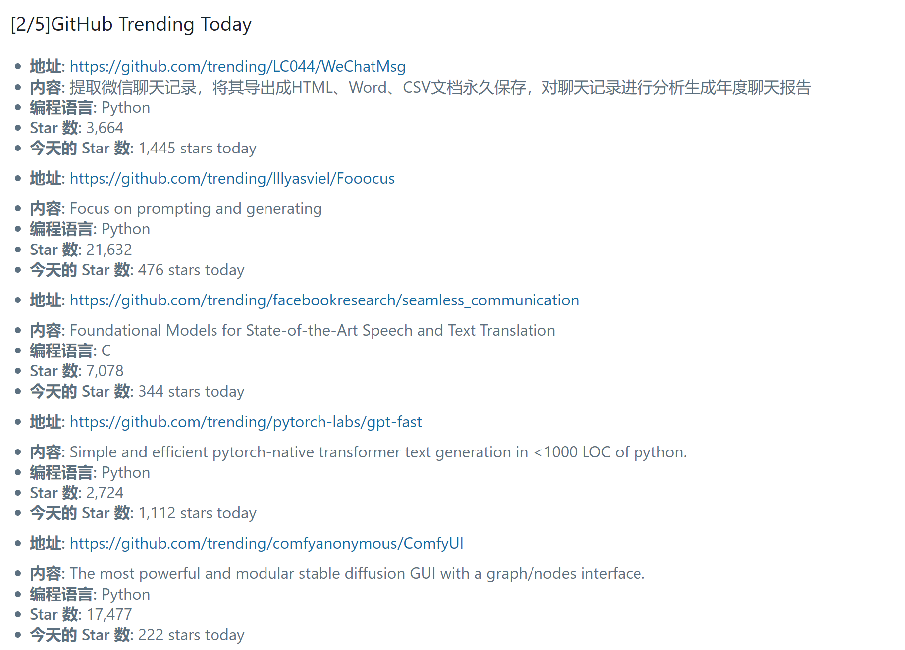

# Gtrending-wx

## 介绍
Send github trending everdays to wechat base on FunctionGraph

## 开发环境
* python >= 3.7

## 使用方式

### 环境安装
首先需要下载本仓库：
```shell
git clone ...
cd Gtrending-wx
```
然后使用 pip 安装依赖：
```
pip install -r requirements.txt
```

### 相关配置
server酱key获取参考官网

在项目下的send文件中的server_chan_key进行配置

### 本地运行
* 手动执行
```shell
python index.py
```
* 定时执行

### 云函数调用
将项目传上至云端中每日定时执行
配置相关函数调用和定时任务


### 结果
